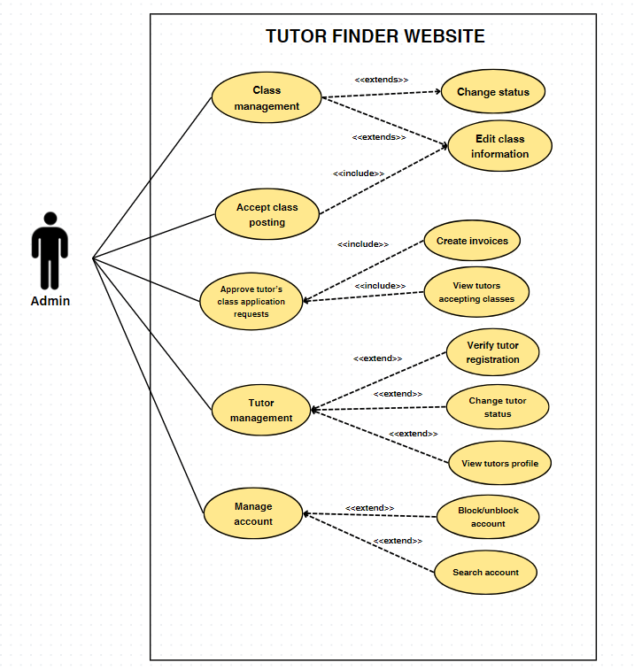
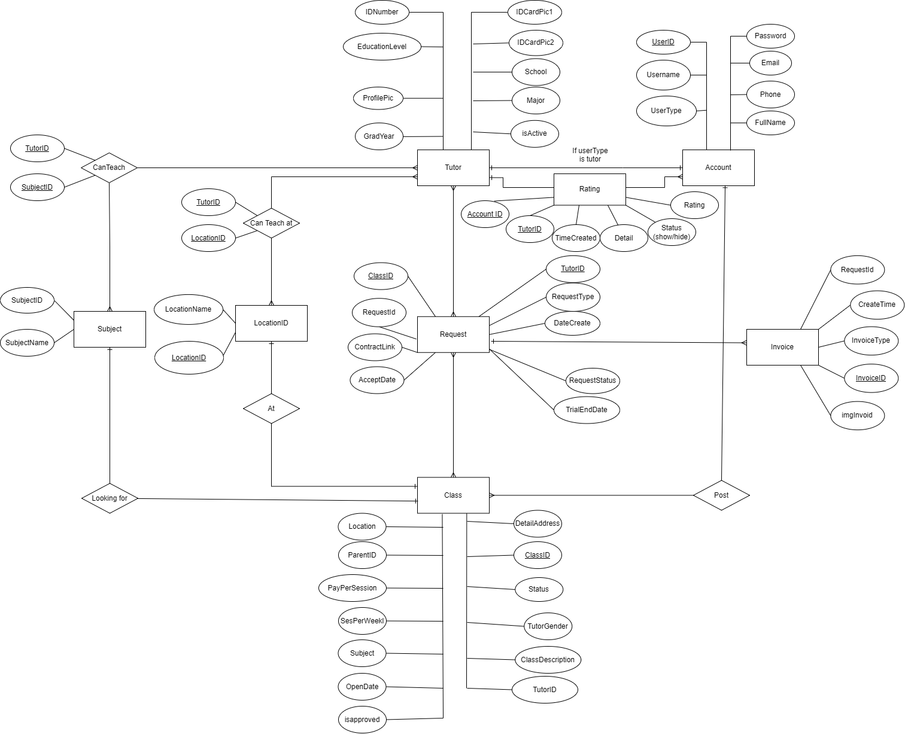

# Introduction
Tutor-finder connects parents seeking qualified tutors for their children with experienced educators. Parents can either browse tutor profiles or post class listings that tutors can apply for. The platform also helps admins to efficiently manage requests from both parents and tutors, including hiring a tutor, applying for a class, and tutor registration

## Use case diagram

## Entity Relationship Diagrams

